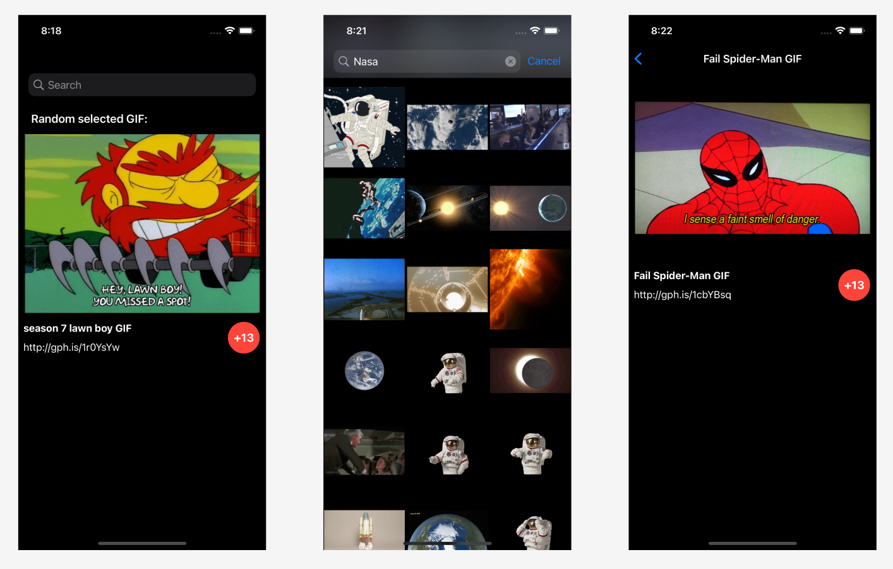

# GIFUP
<h2> <b> GIFUP  </b> </h2>
<h4> <b> GIFUP is an app to search and watch gif. </b> </h4> 
<h4> <b> API: https://giphy.com </b> </h4> 
 
<a href="https://www.linkedin.com/in/onurustunel/"> LinkedIn </a> 

 

App Screen 

 

